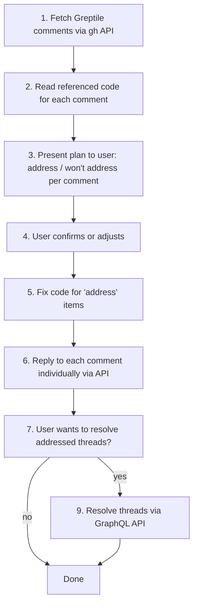

# Respond to Greptile PR Comments

Review each Greptile comment on a PR, plan responses with the user, fix the code, reply individually to each comment, and optionally resolve addressed threads.

## Workflow



## Step 1: Fetch Greptile Comments

Get the PR number (from user or current branch). Then fetch all Greptile review comments:

```bash
# Get all review comments by Greptile on a PR
PR_NUMBER=123
gh api "repos/{owner}/{repo}/pulls/${PR_NUMBER}/comments" \
  --jq '[.[] | select(.user.login == "greptile-apps[bot]") | select(.in_reply_to_id == null) | {id, node_id, body, path, line}]'
```

**Important:** Filter `in_reply_to_id == null` to get only top-level comments (not replies within threads). The bot username is `greptile-apps[bot]` (NOT `greptile[bot]`).

To get the thread IDs needed for resolving later, also fetch via GraphQL:

```bash
REPO_FULL=$(gh repo view --json nameWithOwner -q '.nameWithOwner')
OWNER=$(echo $REPO_FULL | cut -d/ -f1)
REPO=$(echo $REPO_FULL | cut -d/ -f2)
gh api graphql -f query="
query {
  repository(owner: \"$OWNER\", name: \"$REPO\") {
    pullRequest(number: $PR_NUMBER) {
      reviewThreads(first: 100) {
        nodes {
          id
          isResolved
          comments(first: 1) {
            nodes {
              databaseId
              author { login }
              body
            }
          }
        }
      }
    }
  }
}"


```

## Step 2: Read Referenced Code

For each comment, read the file and lines it references. Understand the context before deciding on a response. Do NOT skip this step — responding without reading the code leads to generic, unhelpful replies.

## Step 3: Present Plan to User

Present a table to the user showing each comment and your recommendation:

```
| # | File | Comment Summary | Action | Reason |
|---|------|----------------|--------|--------|
| 1 | services/foo.ts:116 | Silent data truncation | Address | Valid concern, will add pagination |
| 2 | pages/bar.ts:321 | Magic number 10000 | Won't address | Intentional - max page size constant |
| 3 | ... | ... | ... | ... |
```

For each "Address" item, briefly describe what you'll change.
For each "Won't address" item, explain why (valid reason, out of scope, disagree, etc.).

**Wait for user confirmation before proceeding.** The user may reclassify comments.

## Step 4: Fix Code

For each comment marked "Address", make the code change. Follow the project's normal coding standards and design principles.

After fixing, use the `/precommit-check` skill to validate all changes are correct.

## Step 5: Reply to Each Comment

Reply to EACH Greptile comment individually using the REST API. Do NOT post a single summary comment.

```bash
# Reply to a specific review comment
gh api "repos/{owner}/{repo}/pulls/${PR_NUMBER}/comments" \
  -f "body=Your reply text here" \
  -F "in_reply_to=${COMMENT_ID}"
```

**Reply guidelines:**
- **Addressed comments:** "Fixed — [brief description of what was done]."
- **Won't address comments:** Explain why concisely. e.g., "This is intentional — [reason]." or "Out of scope for this PR — tracked in [issue]."
- Keep replies concise. No boilerplate like "Thanks for the feedback".

## Step 6: Optionally Resolve Threads

Ask the user if they want to resolve the threads for addressed comments. Only resolve after the user has reviewed the replies.

To resolve a thread, use the GraphQL mutation with the thread ID (format `PRRT_xxx`) obtained in Step 1:

```bash
gh api graphql -f query='
mutation($threadId: ID!) {
  resolveReviewThread(input: {threadId: $threadId}) {
    thread { isResolved }
  }
}' -f threadId="PRRT_kwDOxxxxxx"
```

Resolve only threads for "Address" comments. Do NOT resolve "Won't address" threads — leave those open for discussion.

## Common Mistakes

| Mistake | Fix |
|---------|-----|
| Using wrong bot username | It's `greptile-apps[bot]`, not `greptile[bot]` |
| Posting one summary comment | Reply individually to each comment via `in_reply_to` |
| Replying without reading code | Always read the referenced file/lines first |
| Skipping the code fix step | Actually fix the code before replying "Fixed" |
| Resolving before user reviews | Always ask user before resolving threads |
| Using REST to resolve threads | Thread resolution requires GraphQL `resolveReviewThread` mutation |
| Resolving "won't address" threads | Only resolve threads where the feedback was addressed |
| Including Greptile's "Prompt To Fix" block | Ignore the `<details>` block — focus on the actual comment body |
